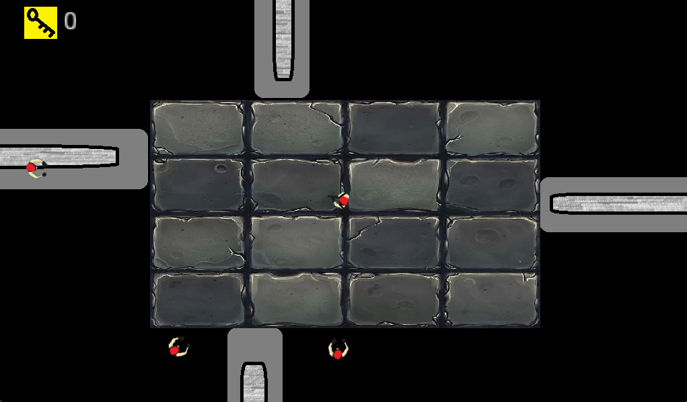

# 10_Llaves

## General description
"10 llaves" is a little project for Game Platforms, a subject from UACH. 
"10 llaves" is a top-down 2D shooter where the player needs to collect 10 keys in each level to go to the next one. And it has 3 levels.
Each level is different in location and ambient but the challenge is the same, open your path all the way to the third and last level shooting every single zombie you see, remember is you or them.
	
## Controls
Is played with mouse and keyboard:
* WASD as the keys to move the character
* Mouse to aim the gun
* Left click to shoot the gun
